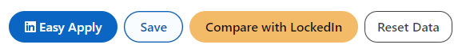
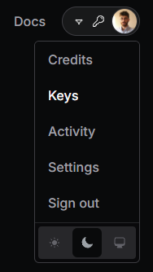
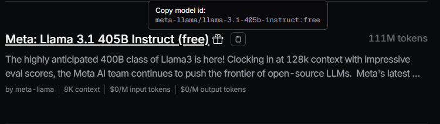

# LockedIn

## Description

A tool for comparing resumes and job descriptions on LinkedIn using AI for free.

Extension uses [Open Router](https://openrouter.ai) API which host multiple different LLM models.
Some of those models have free API for testing and using. We are basically using these free LLM's to compare your resume and job description.

## Requirements

1. OpenRouter API key.
    - Click here and [sign up](https://openrouter.ai).
    - From top right corner, hover your profile picture and click **Keys**. (_see [screenshot](#openrouter-menu) below_)
    - Click **Create Key** button, give your key a name and click **Create**.
    - Save your key somewhere.
2. A resume in text format (_see `/examples`_).
    - You can use ChatGPT or Claude to convert your resume to text.
    - If you are using RenderCV like me, you can use your data in config YAML file. `/examples/example-resume.yaml` is a RenderCV example and `/examples/exaple-resume.txt` is the text version of it.
3. A LLM model name from OpenRouter.
    - Go to [OpenRouter Browse Models](https://openrouter.ai/models?order=pricing-low-to-high) page.
    - If you look closer, you will see some models have free APIs.
    - Select a model and click copy icon right next to its name. (_see [screenshot](#openrouter-model-name) below_)  
      _Free limit: If you are using a free model variant (with an ID ending in :free), then you will be limited to 20 requests per minute and 200 requests per day._ [Learn more](https://openrouter.ai/docs/limits)

## Installation

1. Download the latest release.
2. Follow the steps below.

## How Can I Install this on X Browser?

<details>
  <summary>Chrome</summary>

1. Open Chrome and navigate to `chrome://extensions/`.
2. Enable **Developer Mode** (toggle in the top right).
3. Click **Load unpacked**.
4. Select the downloaded `lockedin` folder.
5. The extension should now appear in your extension list.

</details>

<details>
  <summary>Firefox</summary>

1. Open Firefox and go to `about:debugging`.
2. Click on **This Firefox** in the left sidebar.
3. Click **Load Temporary Add-on**.
4. Choose the `manifest.json` file in downloaded `lockedin` folder.
5. The extension will be temporarily loaded and will stay active until you restart Firefox.

</details>

<details>
  <summary>Microsoft Edge</summary>

1. Open Edge and navigate to `edge://extensions/`.
2. Enable **Developer Mode** (toggle in the bottom left).
3. Click **Load unpacked**.
4. Select the downloaded `lockedin` folder.
5. The extension should now appear in your extension list.

</details>

<details>
  <summary>Brave</summary>

1. Open Brave and go to `brave://extensions/`.
2. Enable **Developer Mode** (toggle in the top right).
3. Click **Load unpacked**.
4. Select the downloaded `lockedin` folder.
5. The extension will appear in the list of extensions.

</details>

<details>
  <summary>Opera</summary>

1. Open Opera and navigate to `opera://extensions/`.
2. Enable **Developer Mode** (toggle in the top right).
3. Click **Load unpacked**.
4. Select the downloaded `lockedin` folder.
5. The extension will be loaded in Opera.

</details>

<details>
  <summary>Vivaldi</summary>

1. Open Vivaldi and go to `vivaldi://extensions/`.
2. Enable **Developer Mode** (toggle in the top right).
3. Click **Load unpacked**.
4. Select the downloaded `lockedin` folder.
5. The extension will appear in your extension list.

</details>

## Usage

1. Go to any job posting on LinkedIn
2. You will see two buttons next to **Apply** and **Save** called **Compare with LockedIn** and **Reset Data**. (_See [screnshot](#lockedin-buttons) section_)
3. You can add or change your data or see your current data. (_Like your API key or your selected LLM model_)
4. You need to add your data first. Click **Reset Data** button. You will be asked your API key, resume in text format and your OpenRouter model name. Fill the inputs accordingly.
5. Once you are done, click **Compare with LockedIn** button, after few seconds, you will see your comparison.

## Screenshots

### LockedIn Buttons



### OpenRouter Menu



### OpenRouter Model Name



## Development

```terminal
git clone https://github.com/whit3st/lockedin.git
cd lockedin
pnpm install
pnpm start
```

## Contributing

1. Fork the Project
2. Create your Feature Branch  
   (`git checkout -b feature/AmazingFeature`)
3. Commit your Changes  
   (`git commit -m 'Added some AmazingFeature'`)
4. Push to the Branch  
   (`git push origin feature/AmazingFeature`)
5. Open a Pull Request

## License

Distributed under the MIT License. See LICENSE for more information.

## Contact

[Email](mailto:alican15033@gmail.com)
